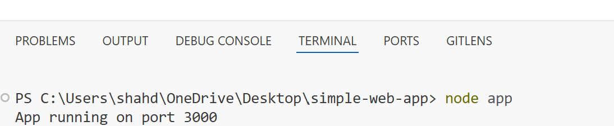
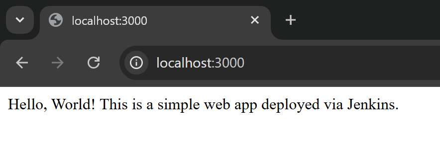
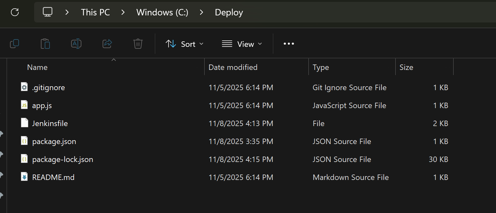
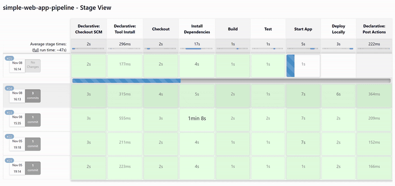

# Simple Web App with Jenkins Pipeline
This is a basic Node.js web app using Express. It includes a Jenkins pipeline for CI/CD.

📁 Project Structure

simple-web-app/
├── app.js
├── package.json
├── .gitignore
├── Jenkinsfile
├── README.md
└── scr/
    └── run.png
    └── app.png
    └── cop.png
    └── pip-st.gif

## Setup
1. Install dependencies: `npm install`
2. Run the app: `npm start`
3. Access at `http://localhost:3000`

## Jenkins Pipeline
- Checkout code from Git.
- Install dependencies.
- Build and test.
- Deploy locally.

## Requirements
- Node.js
- Jenkins
- Git

📸 Screenshots

🎞️ CI/CD Pipeline GIF

👩🏻‍💻 Author

Shahd Abd Almonem

Part of the DevOps 6-Month Learning Path

📜 License

MIT License © 2025 Shahd Abd Almonem